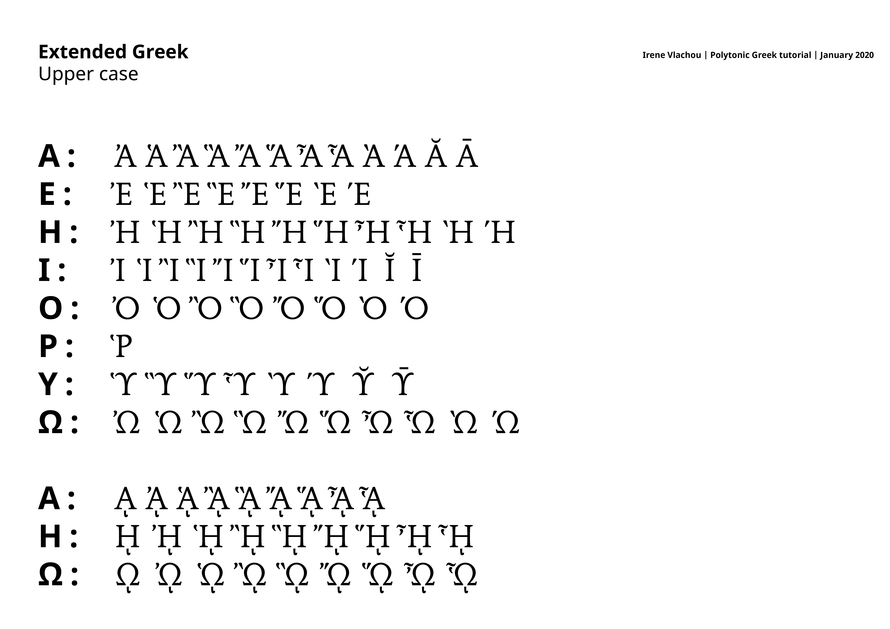
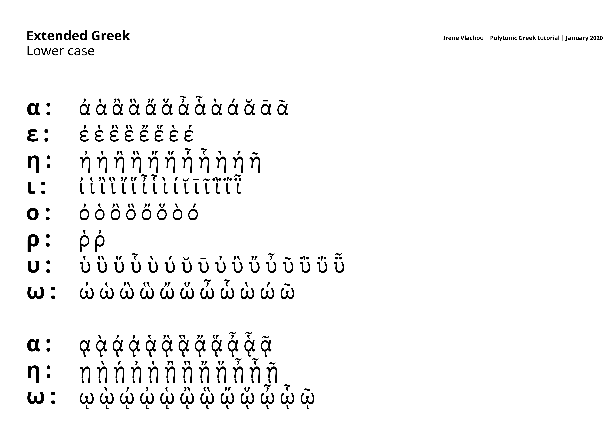
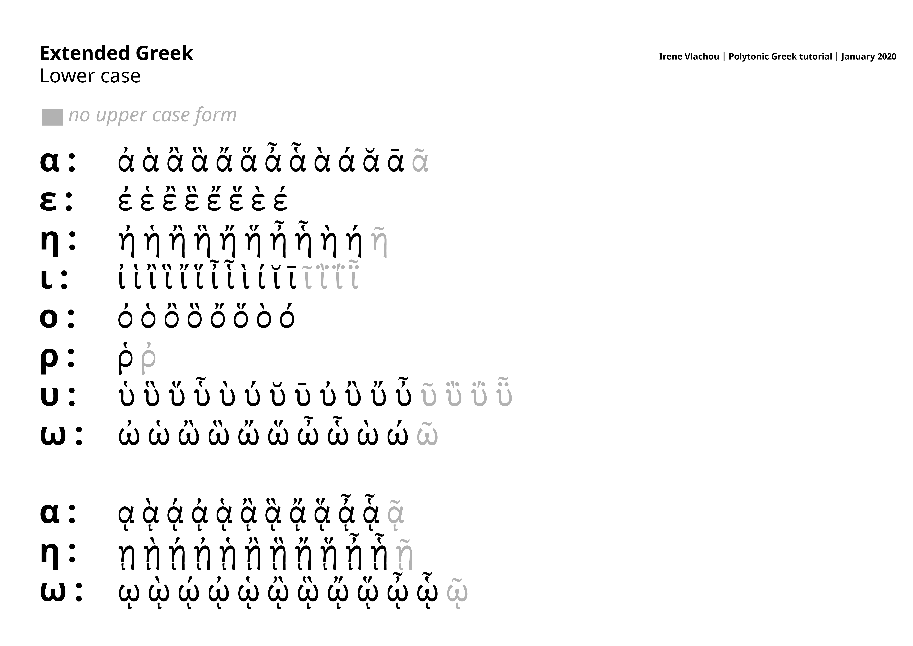
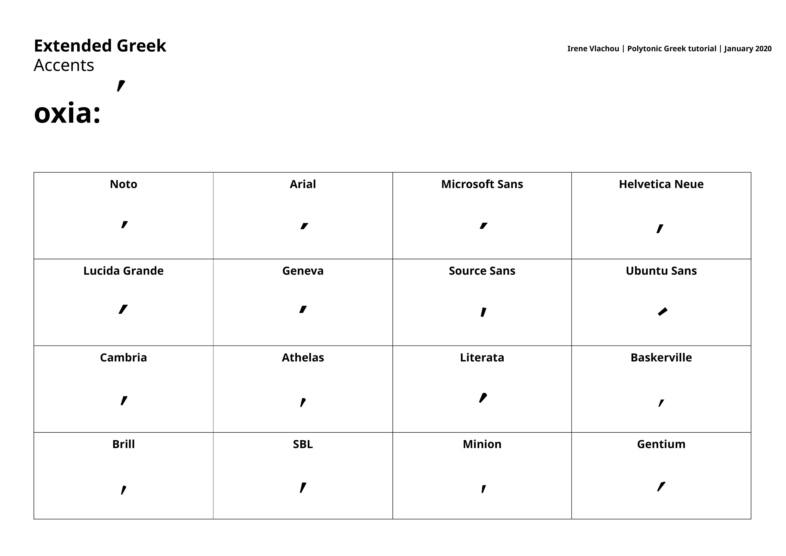
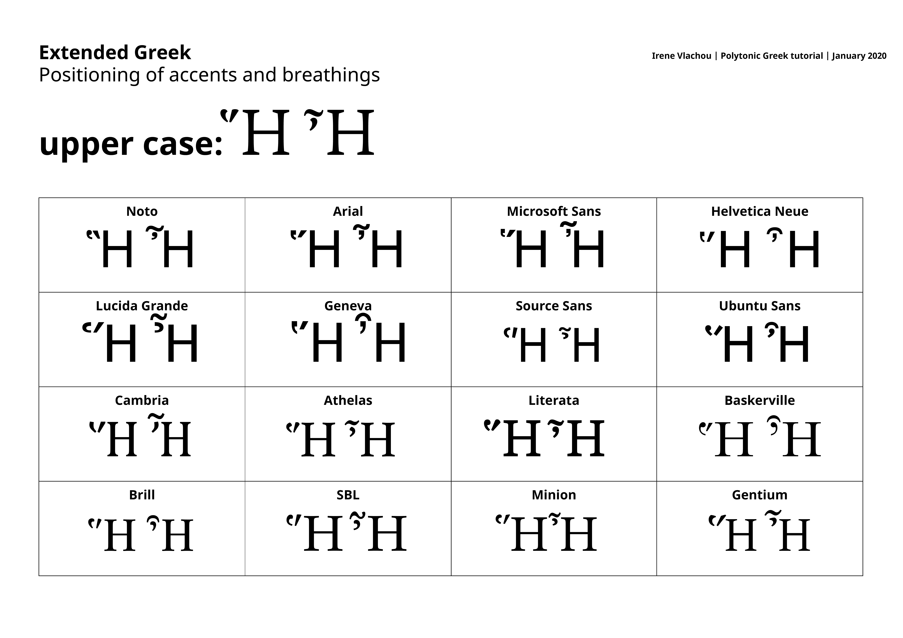
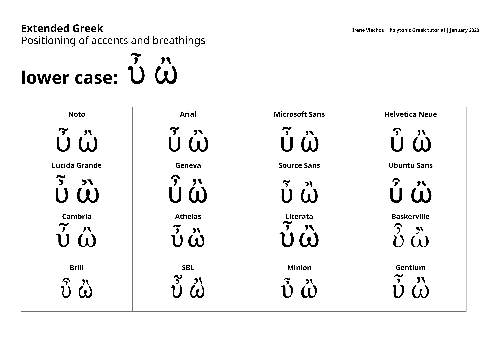
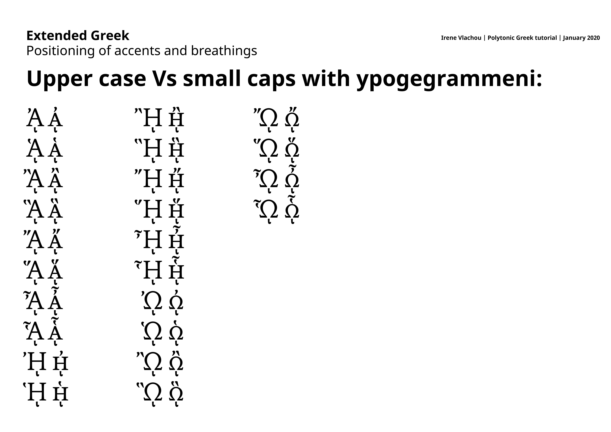
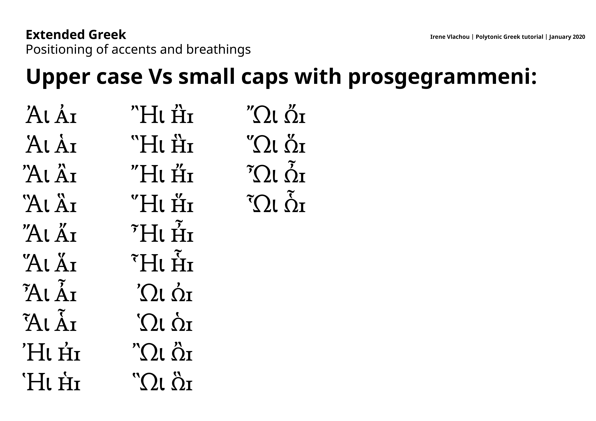

# Polytonic Greek: a guide for type designers

## Introduction
This tutorial explains how to add Polytonic characters to an existing Monotonic Greek typeface. In terms of the [Google Fonts Glyph Sets/Greek/](https://github.com/googlefonts/gftools/tree/master/Lib/gftools/encodings/GF%20Glyph%20Sets/Greek) defined in 2017, I explain how to extend a Greek Core set into Greek Plus set.

I hope to demystify polytonic type design and encourage type designers to add polytonic to their typefaces. Designing a small number of diacritics and following some positioning rules hopefully will make the expansion of the Greek set more accessible to type designers.
Adding polytonic Greek in contemporary typefaces has not been a priority today and that leaves us with a very few choices when typesetting polytonic text and usually these choices are either based on the French style or Porsonic models, and rarely something more contemporary than 19th century style typefaces. 

This tutorial covers:

* the design of the required glyphs,
* technical information including character encoding,
* external resources of examples,
* external related material.

I hope it will provoke some discussion and feedback that can be incorporated as a later version of this document.

## Background

Polytonic Greek is the system of Greek orthography, using multiple diacritical marks, that for centuries was the standard for writing modern Greek. In January 1982 the Greek government declared a new official orthography, a “monotonic” system that retained only two diacritics. The current official standard uses the acute accent, generally referred to as tonos in the context of Greek, and the dieresis.

Despite the official change, and the vast majority of new Greek publishing being monotonic, polytonic orthography is a valid option for modern Greek typesetting. A daily newspaper, [Ἑστία](https://el.wikipedia.org/wiki/Εστία_(εφημερίδα)) uses polytonic, traditional and religious publications are often published in polytonic. Thus, as well as older texts, modern texts exist and are being produced that using polytonic characters that require polytonic fonts, and so a polytonic set is strongly recommended for system fonts and other fonts expected to perform on a wide variety of texts.

More background information can be found in the Resources section below.

## Usage

This set adds all the accented letters, lower case and upper case, and the accents+breathings necessary to build these composites. It's basically what Unicode defines as “Greek Extended” with the addition of forgotten iota subscript (U+037A).
http://www.unicode.org/charts/PDF/U1F00.pdf

The Greek Plus set omits Greek archaic letters and archaic numerals that one often finds in older Polytonic Greek fonts. These are: the archaic letters: digamma, textual koppa and the numerals: stigma, numeric koppa, sampi, all in both upper case and lower case form. The specific archaic characters and numerals, even if not many, require special attention and research on behalf of the designer. These characters are rarely used and the existing examples of these characters are often poorly designed. 
Adding polytonic to a pre-existing Greek set can be done almost entirely by the use of composites. Speeding up the process of creating polytonic Greek fonts will give polytonic users the chance to typeset their text with a much wider variety of typefaces, and hopefully few a bit more modern looking than Didot :)

## Character set
[Google’s Greek Sets](https://github.com/googlefonts/gftools/tree/master/Lib/gftools/encodings/GF%20Glyph%20Sets/Greek)

### Upper case:
Polytonic Greek is consisted by the addition of 96 Upper case

ἈἉἊἋἌἍἎἏᾺΆᾸᾹᾼᾈᾉᾊᾋᾌᾍᾎᾏ  
ἘἙἚἛἜἝῈΈ  
ἨἩἪἫἬἭἮἯῊΉῌᾘᾙᾚᾛᾜᾝᾞᾟ  
ἸἹἺἻἼἽἾἿῚΊῘῙ  
ὈὉὊὋὌὍῸΌ  
Ῥ  
ὙὛὝὟῪΎῨῩ  
ὨὩὪὫὬὭὮὯῺΏῼᾨᾩᾪᾫᾬᾭᾮᾯ

### Lower case:
and 121 lower case composite glyphs

ἀἁἂἃἄἅἆἇὰάᾰᾱᾶᾳᾲᾴᾀᾁᾂᾃᾄᾅᾆᾇᾷ  
ἐἑἒἓἔἕὲέ  
ἠἡἢἣἤἥἦἧὴήῆῃῂῄᾐᾑᾒᾓᾔᾕᾖᾗῇ  
ἰἱἲἳἴἵἶἷὶίῐῑῖῒΐῗ  
ὀὁὂὃὄὅὸό  
ῥῤ  
ὑὓὕὗὺύῠῡὐὒὔὖῦῢΰῧ  
ὠὡὢὣὤὥὦὧὼώῶῳῲῴᾠᾡᾢᾣᾤᾥᾦᾧῷ

These glyphs are built by monotonic upper and lower case combined with accents, breathings and other diacritics.
These are:

### Accents:
- ´ oxia, U1FFD

- ` varia, U1FEF

- ῀ perispomeni, U1FC0

and macron and breve (vrachy) that we take from the latin set

### Breathings:
- ᾿ psili, U1FBF

- ῾ dasia, U1FFE

### Combinations:
- ῁ dialytica perispomeni, U1FC1

- ῍ psili varia, U1FCD

- ῎ psili oxia, U1FCE

- ῏ psili perispomeni, U1FCF

- ῝ dasia varia, U1FDD

- ῞ dasia oxia, U1FDE

- ῟ dasia perispomeni, U1FDF

### Other diacritics:
- ͺ ypogegrammeni (iota subscript), U037A

- ι prosgegrammeni (iota adscript), U1FBE
https://en.wikipedia.org/wiki/Iota_subscript#Usage

### Punctuation:
- ᾽ koronis, U1FBD
https://en.wikipedia.org/wiki/Smooth_breathing#Coronis

## Design of diacritics

### Design of accents
The design of the polytonic accents are pretty straightforward. The oxia is identical with tonos from monotonic Greek. That means that usually is a bit more upright than the latin acute.

The design of the varia follows the same principle and it is more upright than grave. Suggestion: it can be a mirrored oxia.

Perispomeni usually follows the shape of a tilde, but if the typeface is based on the Porson Greek model, then perispomeni looks like an inverted breve. In some rare occasions it appears straight like a macron.

typeface: New Hellenic  
designer: Victor Scholderer (Lanston Monotype Corporation)    
date: 1927  
source: Greek Printing Types, 1465-1927: Facsimiles from an exhibition of books illustrating the development of Greek printing shown in the British Museum, 1927

typeface:	Porson Greek  
designer/punchucutter: Richard Porson, Richard Austin. 
date: 1808  
source: Greek Printing Types, 1465-1927: Facsimiles from an exhibition of books illustrating the development of Greek printing shown in the British Museum, 1927

typeface: Αγγελικής (Angelikis)  
publisher: A. Panagopoulos  
date: 1967  
source: Κατάλογος Τυπογραφικών Στοιχείων  

Greek macron is identical to latin.
Greek vrachy is identical to breve.

### Design of breathings

Psili or smooth breathing takes the shape of a mirrored "c" shape or a quote/comma. Usually we prefer to keep it in the same dimensions and colour as the accents.

Dasia or rough breathing takes the shape of a "c" shape or a mirrored quote/comma. Usually it's a mirrored psili.

Both psili and dasia are placed over the initial vowel, or over the second vowel of an initial diphthong. So we can never find them in the middle of the world (useful tip for kerning).

### Design of combinations
The rest of the diacritics are combinations of accents, breathings and dieresis. Depending on the style of the font these are positioned closer or more apart between them.

### Design of ypogegrammeni and prosgegrammeni
Before we talk about the form that these two marks take, we should clear up what these marks are and how they are supposed to be used. The mute iota is a character that can be combined with the vowels `α, η, ω` (alpha, eta, omega). It can take two forms, under the glyph and next to a glyph, thus the names adscript (next to:prosgegrammeni) and subscript (under: ypogegrammeni).
The positioning of the mute iota when it comes to lowercase, is always under, so we have one combination of lowercase with subscript iota (U+0345). When it comes to uppercase, the mute iota can be centred under the uppercase glyphs or on the side of it.
In an article by Yannis Haralambous titled "From Unicode to Typography, a Case Study: the Greek Script" at the chapter 1.3.3 we find the following information:
> *"There is some confusion about the uppercase Α Η Ω with mute iota. The glyphs displayed in the Uni­code book show the subscript iota below these letters ; on the other hand, in the name of these characters the mute iota is called prosgegrameni ; this is a neologism meaning "written next to" (while ipogegrameni means "written under"). This does not agree with the glyphs, where the mute iota is indeed placed under, and not next to the letter. "*

This is not the case today, the Unicode block has been updated and the "official" form of the mute iota is next to the upper case glyphs (adscript). Sometimes the glyphs adscript (U+1FBE) is replaced by a full size iota.
The design of the ypogegrammeni (subscript) is usually a small iota and in some occasions just as a single straight quote mark. The prosgegrammeni, can be a full size iota or a iota that doesn't quite reach the x-height. Interesting is the example from Haralambous paper, that shows examples of prosgegrammeni placed next to the uppercase glyphs the position of subscript number. 

Nevertheless the traditional typographic form of the mute iota for the uppercase glyphs and the most common used in Greece is under the glyph (subscript), so we usually build our default Unicode blocks that contain upper case+mute iota with subscripts (U+0345) instead of adscript (U+1FBE). Upper case glyphs with adscript are coded usually as stylistic sets.

### Positioning of accents and breathings
The positioning of the accents and the breathings and their combinations is usually at the optical centre of the lower case glyphs. The bottom tip or the middle of the pair of these diacritics marks should "point" at the centre of the glyph.
In the upper case, the diacritics are hanging on the front of the glyphs like tonos in monotonic. The diacritics in upper case are not optional and the positioning at the front is not a stylistic preference.

### Positioning of ypogegrammeni and prosgegrammeni
The ypogrammeni is placed always at the centre of the glyphs, lower and upper case, with the exception of the lower case eta that is aligned as much as possible with the left vertical stem of the letter.
Prosgegrammeni, with a use only in upper case, is always placed on the right side of the letter, at a distance to represent the natural distance that a lower case iota would have after a capital letter.

### Design of koronis

Koronis or crash is a punctuation mark used to symbolise a type of contraction in which two vowels or diphthongs merge into one new vowel or diphthong. The shape that takes is exactly like psili mark. In modern Greek koronis is obsolete.

## Small caps for polytonic set 
Normally small caps in Greek behave identical to all capitals setting. This means that all the substitution of polytonic small caps glyphs are exactly the same as the monotonic ones.
All accents are omitted other than the dieresis. 
However, there are cases that we want to add a stylistic set of accented small caps. In that case the small caps will have to behave like the lower case and all the accents and breathings need to go on the top of the glyph.

### Considerations
In general, accented small caps might look strange to a native reader. The examples of accented uppercase lookalike shapes in Greek typography are rare so the use of them should be as a stylistic option instead of a mainstream usage.

### OpenType features
Polytonic Greek doesn't have extra OpenType features compared with a monotonic Greek font. Apart from when we want the font to deal with the subscript to adscript transformation for the uppercase and when the font has the option of accented small caps.
The most common way to deal with both issues is to introduce stylistic set features that the necessary rules will apply.

## Resources
- [GF Glyph Sets/Greek/](https://github.com/googlefonts/gftools/tree/master/Lib/gftools/encodings/GF%20Glyph%20Sets/Greek)
- [Greek diacritics](https://en.wikipedia.org/wiki/Greek_diacritics)
- [Re-introduction of the Polytonic System](http://www.polytoniko.org/index.php?newlang=en)
- [Flickr: Polytonic reality](https://www.flickr.com/photos/polytoniko/)
- [Wikipedia: Iota subscript](https://en.wikipedia.org/wiki/Iota_subscript)
- [Titlecase and Adscripts](https://web.archive.org/web/20151026160832/http://www.tlg.uci.edu/~opoudjis/unicode/unicode_adscript.html)
- [Designing Greek typefaces](https://medium.com/@gerryleonidas/designing-greek-typefaces-eac0de7767cc)
- [Guidelines and Suggested Amendments to the Greek Unicode Tables](https://hal.archives-ouvertes.fr/hal-02112005/document)
- [From Unicode to Typography. Greek script](https://b-ok.org/book/438869/c0ec1b/?_ir=1)

## Work in progress

This tutorial will expand on several topics. Some of them will be overlapping with Monotonic orthography rules and might be at a separate tutorial. We'll see :)

Planned so far (suggestions are welcome):
1. OT code for dealing with case conversion for accented caps or small caps while retaining the disjunctive Eta.
2. A report on the issues of case conversion for basic monotonic and polytonic Greek in operating systems, browsers and applications.
3. Spacing of accented caps: an endless debate, hanging or no-hanging (half hanging?).
4. Keyboard layouts and the unreachable characters.
4. Spacing and kerning: rules, groups and test documents.
5. Font application support of automatic building of composites for Polytonic Greek.
6. Samples of old specimens showing Polytonic fonts with some special flair.
7. List of available (Unicode preferably!) Polytonic fonts.

## Acknowledgements

My friends and colleagues [Natalia Qadreh](https://gr.linkedin.com/in/nataliaqadreh), [Kostas Bartsokas](https://www.kostasbartsokas.com), [Gerry Leonidas](https://leonidas.net), [Yannis Haralambous](https://www.imt-atlantique.fr/en/person/yannis-haralambous) and [Thomas Linard](https://github.com/thlinard) for their sharp eyes and great suggestions. 

This project was supported by [Google Fonts](https://fonts.google.com).

Primary font for polytonic samples: [Colvert Greek](https://typographies.fr/N/colvert/colvert.html) by the author :)

## License

by Irene Vlachou 

<a rel="license" href="http://creativecommons.org/licenses/by-sa/4.0/">

